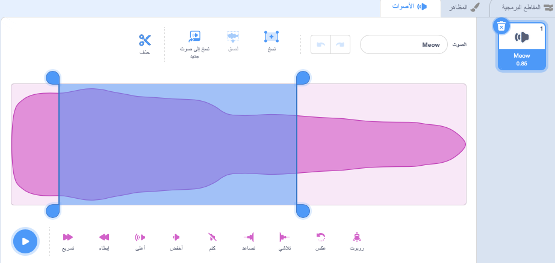
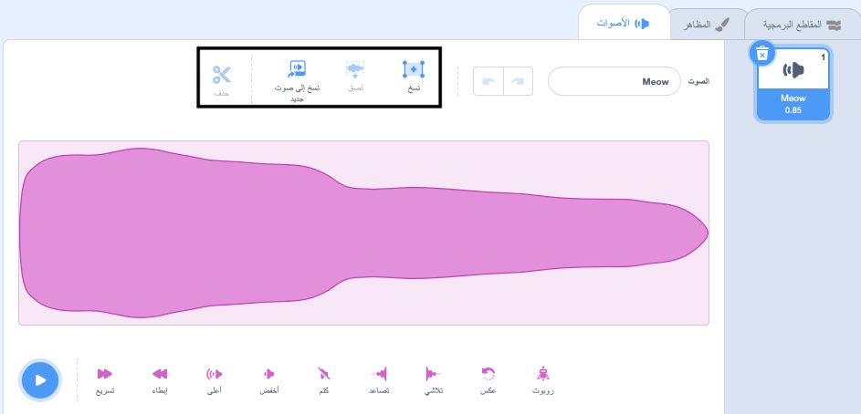

حدد الصوت المراد تحريره.

اختر موقع بدء الصوت الخاص بك الذي تريد تحريره على الموجة الصوتية ثم انقر بزر الماوس الأيسر مع الاستمرار. اسحب مؤشر الماوس إلى موضع النهاية الجديد لصوتك واترك الماوس. سترى مساحة اضاءة على الموجة الصوتية.

إذا كنت تستخدم جهازًا لوحيًا استخدام الماوس أو إصبعك للنقر والسحب فوق الموجة الصوتية.

استخدم أدوات محرر الصوت لنسخ أو نسخ إلى جديد أو لصق أو حذف القسم  البارز من الصوت.

**نصيحة:** يمكنك استخدام أداة التراجع لعكس أي تغييرات لست سعيدًا بها. 
