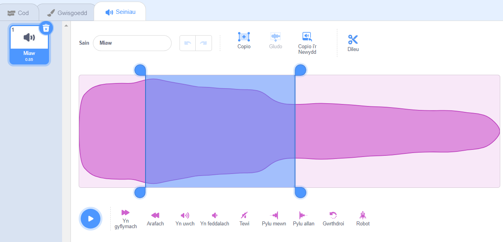
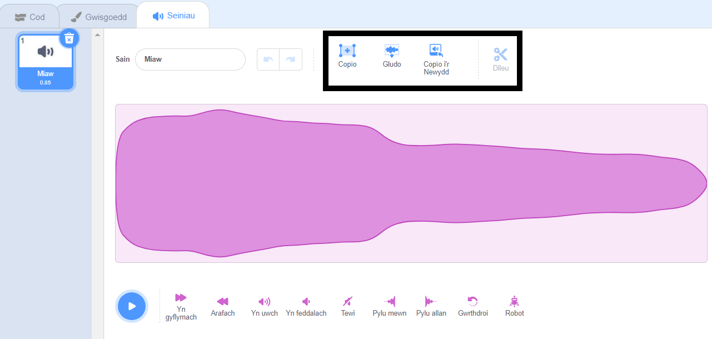

Dewisa'r sŵn i'w olygu.

Dewisa fan cychwyn ar y donfedd ar gyfer y sŵn rwyt ti wedi'i olygu wedyn clicia'r botwm chwith a'i ddal. Llusga bwyntydd y llygoden i'r safle gorffen newydd ar gyfer dy sŵn ac yna gollwng y botwm. Bydd darn wedi'i amlygu yn ymddangos ar y donfedd sain.

Os wyt ti'n defnyddio tabled, defnyddia'r llygoden neu dy fys i dapio a llusgo dros y donfedd sain.

Defnyddia'r offer yn y Golygydd Sain i Gopïo, Copïo o'r Newydd, Gludo neu Ddileu'r adran wedi'i hamlygu.

**Awgrym:** Galli di ddefnyddio'r teclyn Dad-wneud i newid yn ôl unrhyw newidiadau os nad wyt ti'n hapus â nhw. 
