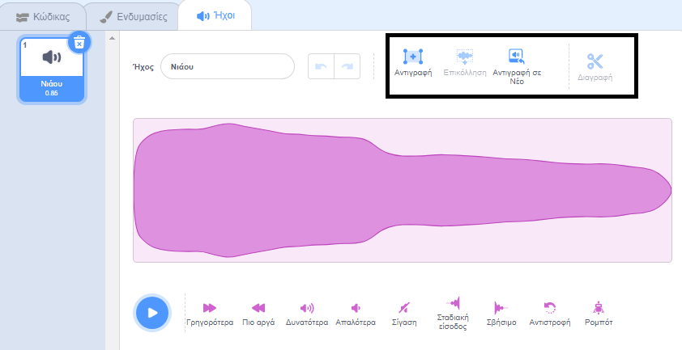

Επίλεξε τον ήχο που θέλεις να επεξεργαστείς.

Επίλεξε μια αρχική θέση για τον ήχο που θα επεξεργαστείς στο ηχητικό κύμα και, στη συνέχεια, κάνε αριστερό κλικ και κράτα το πατημένο. Σύρε το δείκτη του ποντικιού σου στη νέα τελική θέση για τον ήχο σου και άφησέ το. Θα δεις μια τονισμένη περιοχή στο ηχητικό κύμα.

Εάν χρησιμοποιείς tablet χρησιμοποίησε το ποντίκι ή το δάχτυλό σου για να αγγίξεις και να σύρεις πάνω στο ηχητικό κύμα.

Χρησιμοποίησε τα εργαλεία επεξεργασίας ήχου για Αντιγραφή, Αντιγραφή σε Νέο, Επικόλληση ή Διαγραφή του επιλεγμένου τμήματος του ήχου.

**Tip:** You can use the Undo tool to reverse any changes you are not happy with. 
