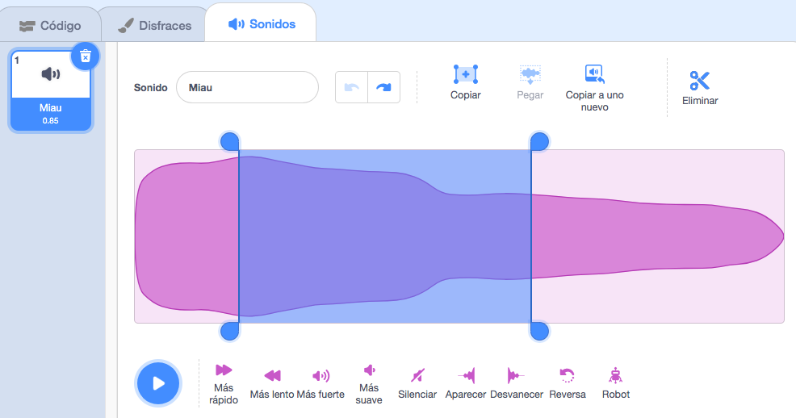
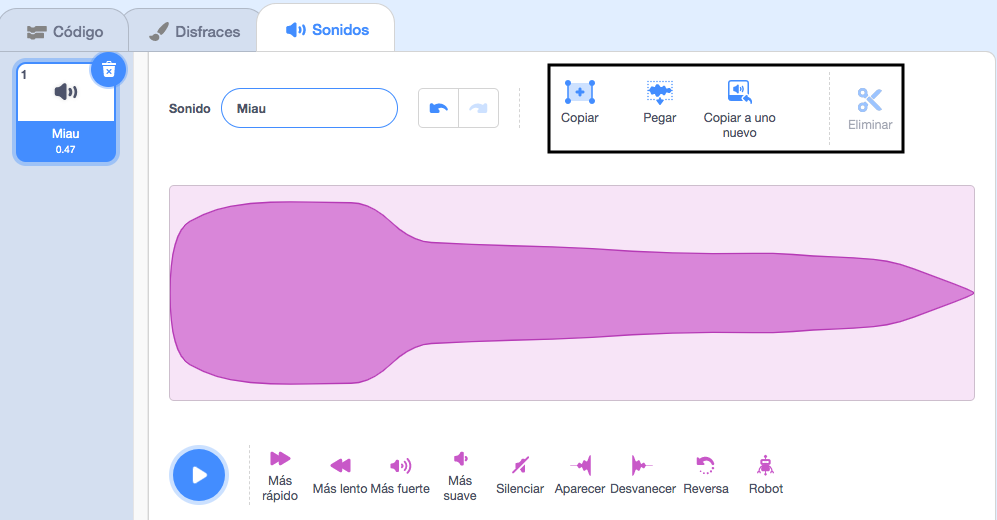

Selecciona el sonido a editar.

Elige una posición inicial para tu sonido editado en la onda de sonido, luego haz clic izquierdo y mantén presionado. Arrastra el puntero del ratón a la nueva posición final para tu sonido y suéltalo. Verás un área resaltada en la onda de sonido.

Si estás usando una tableta, usa el dedo para tocar y arrastrar sobre la onda de sonido.

Usa las herramientas del Editor de sonidos para Copiar, Copiar a uno nuevo, Pegar o Eliminar la sección resaltada del sonido.

**Sugerencia:** Puedes usar la herramienta Deshacer para revertir cualquier cambio que no te satisfaga. 
