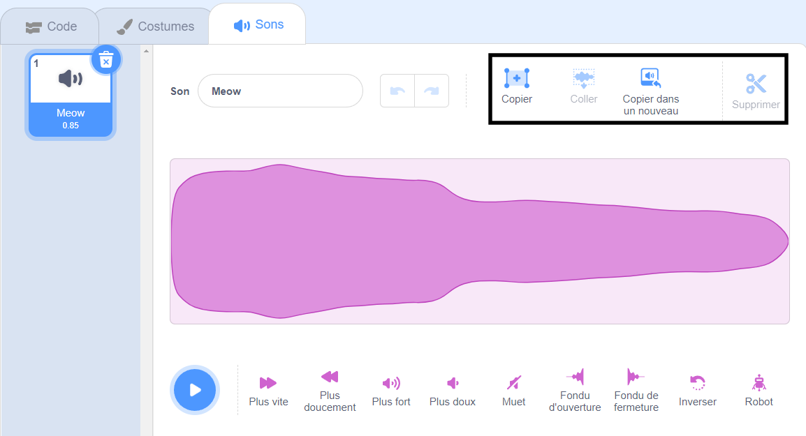

Sélectionner le son à éditer.

Choisis une position de départ pour ton son édité sur l'onde sonore, puis fais un clic gauche et maintiens. Fais glisser le pointeur de ta souris vers la nouvelle position finale de ton son et relâche. Tu verras une zone en surbrillance sur l'onde sonore.

Si tu utilises une tablette, utilise ta souris ou ton doigt pour appuyer et faire glisser sur l'onde sonore.

Utilise les outils de l'éditeur de sons pour copier, copier dans un nouveau, coller ou supprimer la section en surbrillance du son.

**Astuce :** Tu peux utiliser l'outil Annuler pour annuler les modifications qui ne te conviennes pas. 
