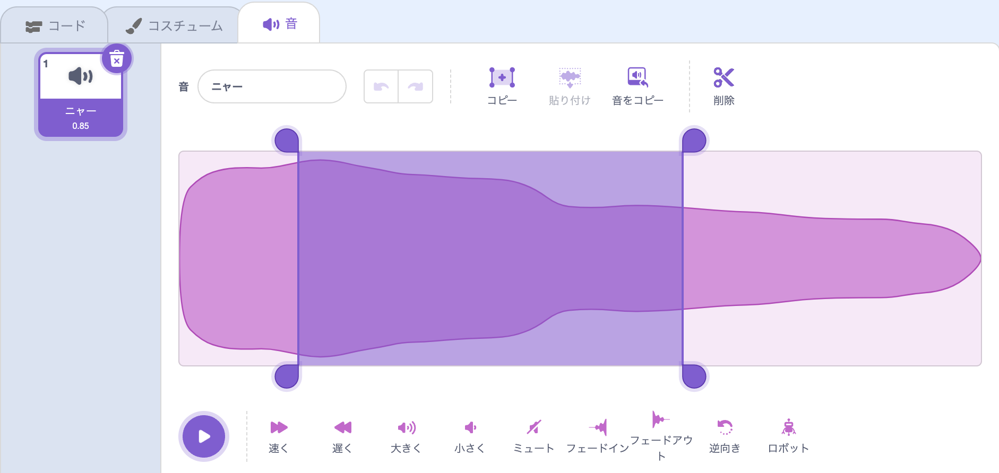

編集する音を選択します。

編集する音の音波の上で開始位置を選択して左クリックを押し続けます。 マウスポインターを音の新しい終了位置までドラッグして放します。 音波上で領域がハイライトされているのがわかります。

タブレットを使用している場合は、マウスまたは指を使用して音波上をタップしてドラッグします。

サウンドエディターツールを使用すると、音のハイライトされた部分をコピー、音をコピー、貼り付け、または削除できます。

**ヒント:** 元に戻すツールを使用すると、うまく行かなかった変更を元に戻すことができます。 
