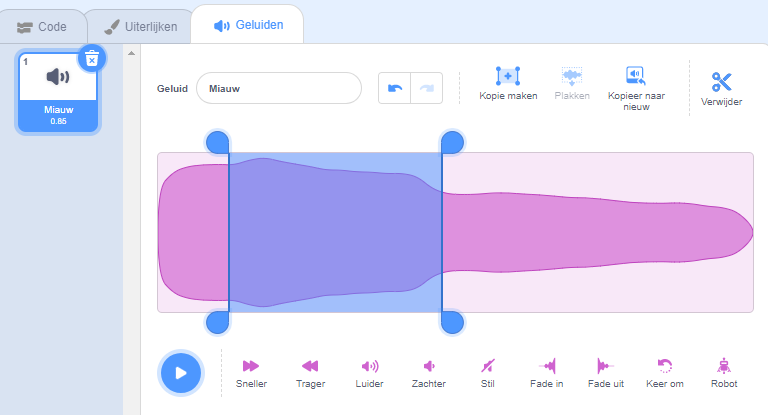
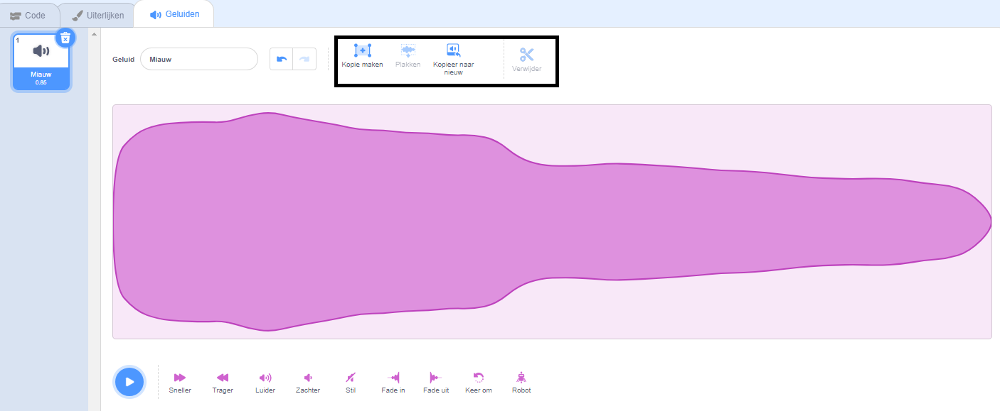

Selecteer het geluid dat je wilt bewerken.

Kies een startpositie voor je bewerkte geluid op de geluidsgolf en klik vervolgens met de linkermuisknop en houd vast. Sleep je muisaanwijzer naar de nieuwe eindpositie voor je geluid en laat los. Je ziet een gemarkeerd gebied op de geluidsgolf.

Als je een tablet gebruikt, gebruik je je muis of vinger om over de geluidsgolf te tikken en te slepen.

Gebruik de geluid bewerkingshulpmiddelen om het gemarkeerde gedeelte van het geluid te kopiëren, naar nieuw te kopiëren, te plakken of te verwijderen.

**Tip:** Je kunt de knop "Ongedaan maken" gebruiken om eventuele wijzigingen waar je niet tevreden over bent ongedaan te maken. 
