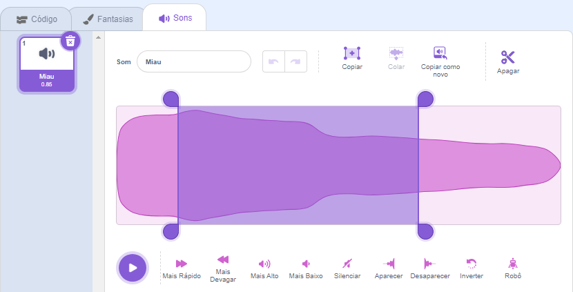
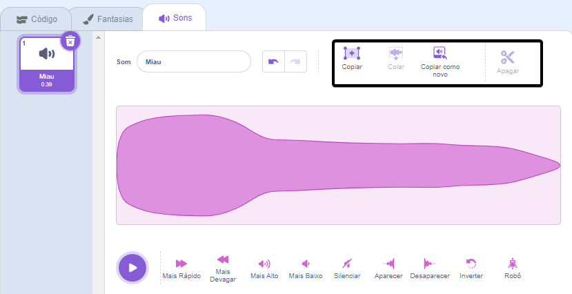

Selecione o som a ser editado.

Escolha uma posição inicial para o som editado na onda sonora e clique com o botão esquerdo e segure. Arraste o ponteiro do mouse para uma nova posição final do som e solte. Você verá uma área destacada na onda sonora.

Se você estiver usando um tablet, use o mouse ou o dedo para tocar e arrastar sobre a onda sonora.

Use as ferramentas do editor de som para copiar, copiar para novo, colar ou excluir a parte destacada do som.

**Dica:** Você pode usar a ferramenta Desfazer para reverter quaisquer alterações com as quais não esteja satisfeito. 
