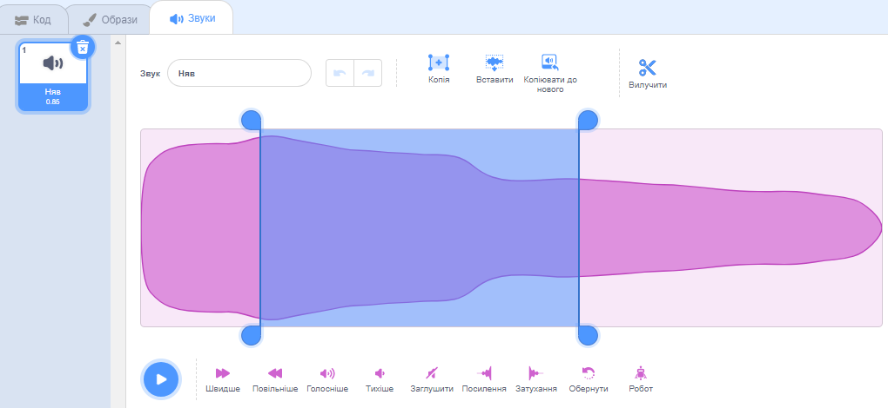

Вибери звук, який потрібно відредагувати.

Вибери початкову позицію на звуковій хвилі та клацни лівою кнопкою миші й утримуй її. Перетягни курсор миші до нового кінцевого положення звукової доріжки і відпусти його. Ти побачиш на звуковій хвилі виділену ділянку.

Якщо ти використовуєш планшет, торкнись звукової хвилі за допомогою миші або пальця і перетягни її.

Використовуй інструменти звукового редактора «Копія», «Копіювати до нового», «Вставити» або «Вилучити», щоб редагувати виділений фрагмент звукової доріжки.

**Порада:** ти можеш скористатися інструментом «Скасувати», щоб відмінити будь-які зміни, які тебе не влаштовують.
